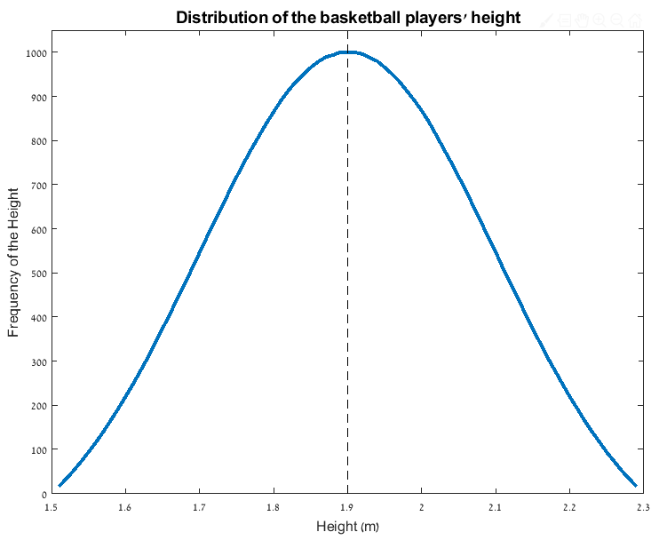
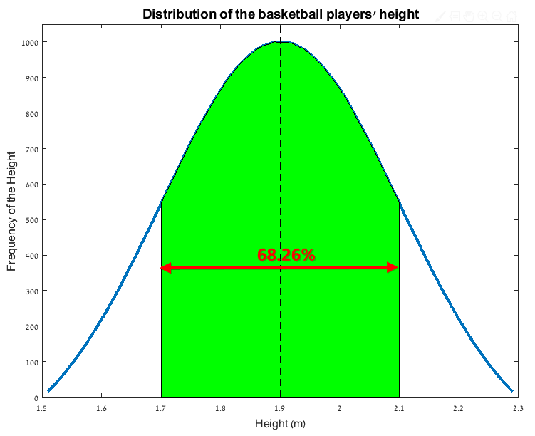
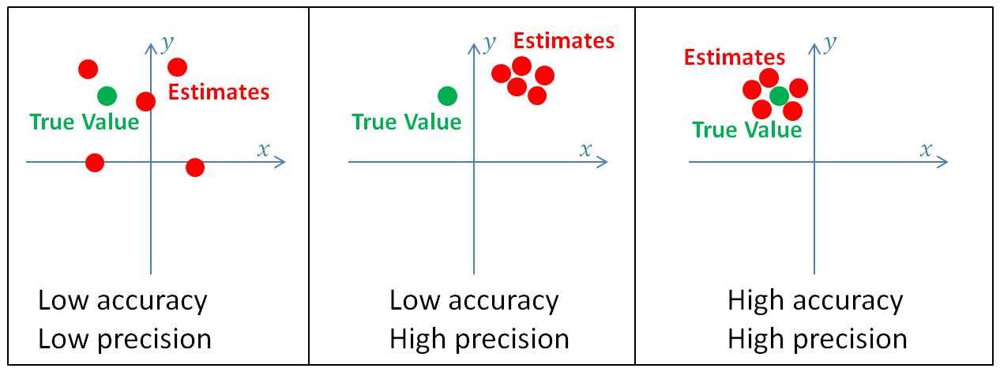
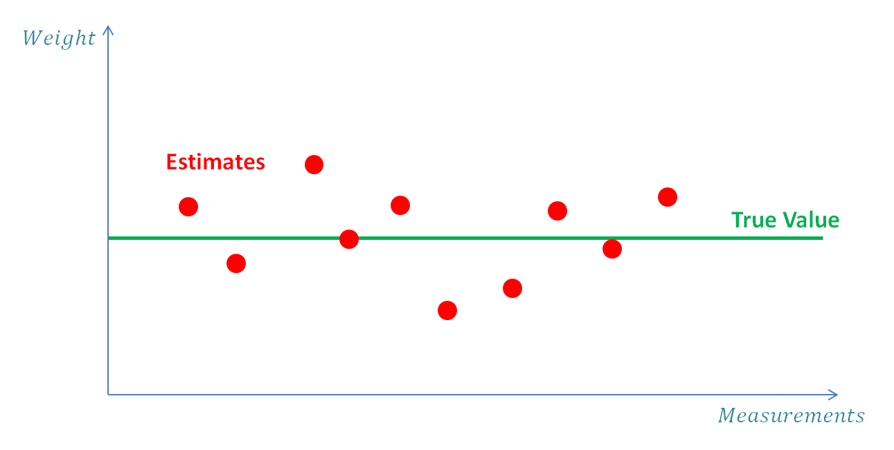
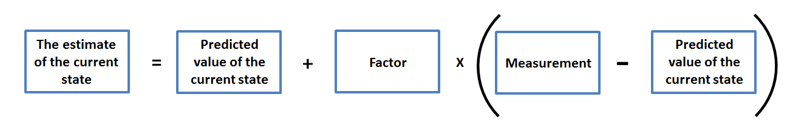
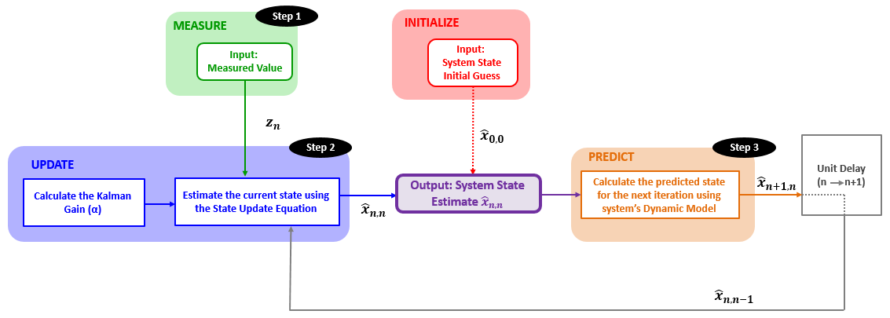
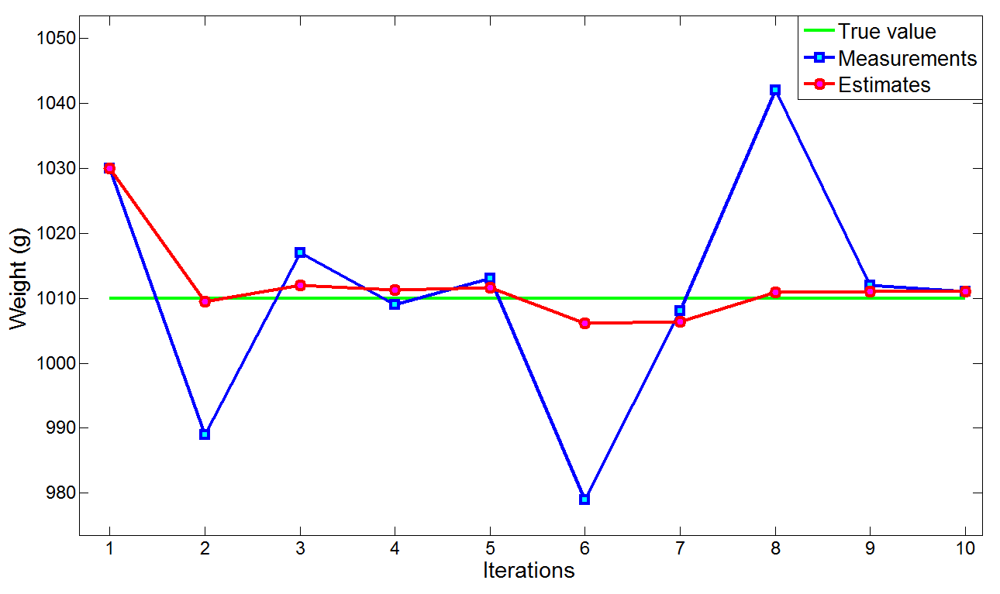
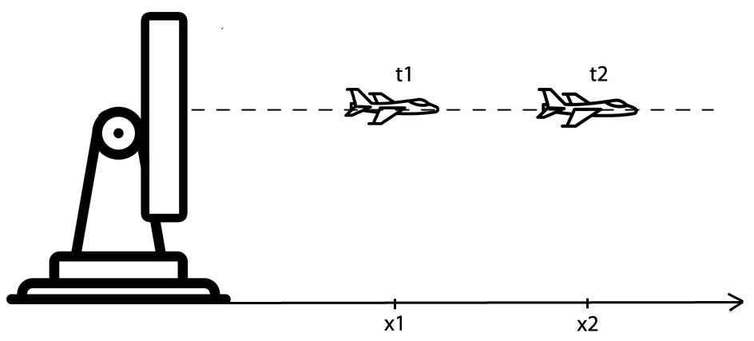
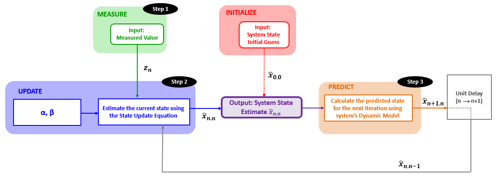
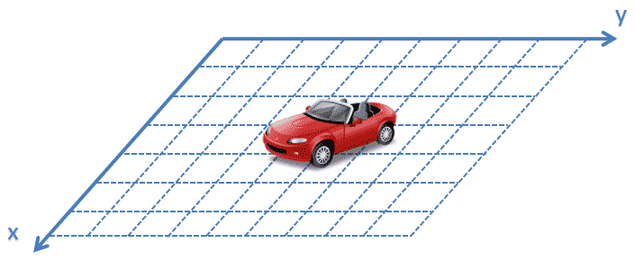

# 卡尔曼滤波

## 1、背景回顾

知识点回顾：**方差、标准差、正态分布、准确度、精确度、期望值和随机变量**

### 1.1 均值、期望简述

$$V_{mean}= \frac{1}{N} \sum _{n=1}^{N}V_{n}= \frac{1}{5} \left( 5+5+10+10+10 \right) = 8cent$$

$$W = \frac{1}{N} \sum _{N=1}^{N} W_{N} = \frac{1}{5} \left(79.8 + 80 + 80.1 + 79.8 + 80.2\right) = 79.98kg$$

- 均值通常用希腊字母$\mu$表示
- 期望通常用希腊字母$E$表示

### 1.2 方差与标准差
* 方差(Variance)描述数据集与均值的离散程度。
* 标准差(Standard Deviation)是方差的平方根

\    | Player1 | Player2 | Player3 | Player4 | Player5 | Mean
:-: | :-: | :-: | :-: | :-: | :-: | :-: |
Team A | 1.89m | 2.1m | 1.75m | 1.98m | 1.85m | 1.914m
Team B | 1.94m | 1.9m | 1.97m | 1.89m | 1.87m | 1.941m

从上表可以看出Team A与Team B五名运动员的身高均值相同，这时候需要通过方差进行比较

假设$x_{n}$表示队员$n$的身高, 希腊小写字母$\mu$表示均值。 变量与均值的距离表示为:

$$d_{i} = x_{n} - \mu$$

下表表示每个队员升高与平均值的距离

\ |Player1|Player2|Player3|Player4|Player5|
:-:|:-:|:-:|:-:|:-:|:-:|
TeamA|-0.024m|0.186m|-0.164m|0.066m|-0.064m|
TeamB|0.026m|-0.014m|0.056m|-0.024m|-0.044m|

为了消除上表中的负值，对d进行平方处理：
$$d_{i}^{2} = (x_{n} - \mu)^{2}$$

下表表示距离的平方：
\ |Player1|Player2|Player3|Player4|Player5|
:-:|:-:|:-:|:-:|:-:|:-:|
Team A|$0.000576m^{2}$|$0.034596m^{2}$|$0.026896m^{2}$|$0.004356m^{2}$|$0.004096m^{2}$|
Team B|$0.000676m^{2}$|$0.000196m^{2}$|$0.003136m^{2}$|$0.000576m^{2}$|$0.001936m^{2}$|

用希腊字母$\sigma$表示标准差，方差定义为:
$$\sigma^{2} = \frac{1}{N} \sum_{n=1}^{N} d_{n}^{2} = \frac{1}{N} \sum_{n=1}^{N} (x_{n} - \mu)^{2}$$

根据方差定义可以计算Team A 方差$\sigma_{A}^{2}$:
$$\sigma_{A}^{2} = \frac{1}{N} \sum_{N=1}{N} (x_{n} - \mu)^{2} = 0.014m^{2}$$
$\sigma_{B}^{2}$:
$$\sigma_{B}^{2} = \frac{1}{N} \sum_{n=1}^{N} (x_{n} - \mu)^{2} = 0.0013m^{2}$$

方差描述了样本与样本均值的离散程度，方差越小说明样本的波动越小。

标准差$\sigma$:

$$\sigma = \sqrt{\frac{1}{N} \sum_{n=1}^{N} (x_{n} - \mu)^{2}}$$

Team A标准差: $\sigma_{A} = 0.12m$, Team B标准差: $\sigma_{B} = 0.036m$

对于总体估计问题，采用贝塞尔校正：
$$\sigma^{2} = \frac{1}{N - 1} \sum_{n=1}^{N}(x_n - \mu)^2$$
贝塞尔校正的数学证明见[VisionDummy](http://www.visiondummy.com/2014/03/divide-variance-n-1/)。

### 1.3 正态分布

从上图可以看出，有$68.26\%$选手身高落在$1.7m-2.1m$之间

* 正太分布概率密度函数$f(x;\mu,\sigma^2)$:

$$f(x;\mu,\sigma^2) = \frac{1}{\sqrt{2\pi}\sigma^2}e^{\frac{-(x - \mu)^2}{2\sigma^2}}$$

通常，测量误差分布服从正态分布，卡尔曼滤波基于卡曼滤波服从正态分布。

### 1.4 随机变量

所有的测量量都是连续的随机变量

### 1.5 估计、准确度及精确度

* **估计(Estimate)**: 估计用于评估系统的未知状态
* **准确度(Accuracy)**: 表示测量值与真实值之间的接近程度
* **精确度(Precision)**: 表示多次测量值的集中程度

> 高精确度系统(测量值集中)测量值方差较低，相反低精确度系统(测量值分散)有较大的方差，因此，用方差来表示随机变量的测量误差

> 低准确度系统称为偏差系统(Bias system), 因为测量存在一个内在的系统误差

>通过平均或平滑测量，方差的影响可以显著降低。例如，如果我们使用带有随机测量误差的温度计测量温度，我们可以进行多次测量并将其平均。由于误差是随机的，一些测量值会高于真值，而另一些则低于真值。估计值将接近真实值。我们做的测量越多，估计就越接近。

> 另一方面，如果温度计存在偏差，对温度的估计将存在系统误差

### 1.5 总结
下图显示了测量的统计视图:    

* 上图可以看出，测量是一个随机变量，可以用正态分布概率密度函数$f(x; \mu,\sigma^2)$描述

* 测量值的均值是随机变量的期望

* 真值与测量均值之前的偏差称为准确度，通常称为偏差或系统测量误差。

* 分布的离散度是测量精确度，也称为测量噪声或随机测量误差或测量不确定度。

----

## 2 $\alpha-\beta-\gamma滤波器$

### 2.1 例1、黄金称重

为了估计系统状态(黄金重量值)， 对黄金进行对此测量，然后取平均值

假设测量次数为$N$, 估计值$x_{N,N}$等于多次测量值的平均值:

* 本教程中估计值用变量上加^表示

$$\hat{x}_{N,N} = \frac{1}{N}(z_1+z_2+z_3+\ldots+z_N)= \frac{1}{N}\sum_{n=1}^{N}z_n$$

>样例中:   
$x$&emsp; &emsp;表示重量的真值    
$z_n$&emsp;&emsp;表示第$n$次测量的重量值   
$\hat{x}_{n,n}$&emsp;表示第在第$n$次测量后对$x$(n)的估计值(在$z_n$测量完成后的估计值)   
$\hat{x}_{n, n-1}$表示在第$n-1$次测量后对$x$(n)的估计(在$z_{n-1}$测量完成之后的估计值)   
$\hat{x}_{n+1,n}$表示对$n+1$时刻测量值$x$(n)的估计值，估计是在$z_n$测量完成之 后进行的(在$n$时刻对$n+1$时刻的预估)   

* 本例中，假设动态模型是常量，因此: $x_{n+1, n}=x_{n,n}$

为了估算$\hat{x}_{N,N}$，我们需要记住所有的历史测量值。假设我们没有笔和纸来记录测量结果。我们也不能依靠记忆来记住所有的历史测量值。相反，我们希望使用之前的估计值，只需添加一个小的调整(在实际应用中，我们希望节省计算机内存)。我们可以通过一个小的数学技巧做到这一点：

Equations | Notes |
:-:|:-:|
$\hat{x}_{N,N} = \frac{1}{N}\sum_{n-1}^{N}z_n$=| 平均格式: $N$次求和除以$N$
$=\frac{1}{N}(\sum_{n=1}^{N-1}z_n + z_N)$| 前$N-1$次测量求和在加第$N$次测量值，除以$N$
$=\frac{1}{N}\sum_{n=1}^{N-1}z_n + \frac{1}{N}z_N$ | 展开
$=\frac{1}{N}\frac{N-1}{N-1}\sum_{n=1}^{N-1}z_n + \frac{1}{N}z_N$| 同时乘以、除以$N-1$
$=\frac{N-1}{N}\frac{1}{N-1}\sum_{n=1}^{N-1}z_n+\frac{1}{N}z_N$| 重新组合，其中$\frac{1}{N-1}\sum_{n=1}^{N-1}z_n$是$n-1$时刻，对$n$时刻的估计$\hat{x}_{N,N-1}$
$=\frac{N-1}{N}\hat{x}_{N,N-1}+\frac{1}{N}z_N$ | 用$\hat{x}_{N,N-1}$替换$\frac{1}{N-1}\sum_{n=1}^{N-1}z_n$
$=\hat{x}_{N,N-1}-\frac{1}{N}\hat{x}_{N,N-1}+\frac{1}{N}z_N$| 分裂项:$\frac{N-1}{N}$
$=\hat{x}_{N,N-1}+\frac{1}{N}(z_N-\hat{x}_{N,N-1})$|重新组合

* 备注:其中$\hat{x}_{N,N-1}$是$N-1$时刻对时刻$N$的状态估计，换句话说，$\hat{x}_{N,N-1}$是预估计。

方程$\hat{x}_{N,N}=\hat{x}_{N,N-1} + \frac{1}{N}(z_N-\hat{x}_{N,N-1})$是卡曼滤波五个方程的其中之一，称为状态更新方程，他的含义如下：

在卡曼滤波中，$factor$称为卡曼增益($Kalman$ $Gain$),通常用$K_n$表示，下标$n$表示卡曼增益随着每次迭代变化。在引入卡曼滤波之前，先用希腊字母$\alpha_{n}$代替$K_n$。

* 综上，状态更新方程可以写为:

$$\hat{x}_{n,n}=\hat{x}_{n,n-1}+\alpha_n(z_n-\hat{x}_{n,n-1})$$

通常将$(z_n-x_{n,n-1})$称为测量残差。

继续样例一的讨论，在测量之前，我们先估计金块的重量，这称为初次估计。后续我们将看到，卡曼滤波要求将初始猜测作为预设，可以任意估计。

#### 2.1.1 估计算法
下表表示了样例中用到的估计算法

#### 2.1.2 数值示例

##### ① 迭代0
**初始化**   
初始化估计金条的重量为$1000g$, 初始值仅在滤波操作的第一次需要，后续将不再需要.

$$\hat{x}_{0,0}=1000g$$

预测：假设金块的实际重量是固定不变的，因此，系统的动力学模型是固定的，下一时刻的状态估计值(预测值)等于初始值:
$$\hat{x}_{1,0}=\hat{x}_{0,0}=1000g$$

##### ② 迭代1

**第一步**
第一次测量值:
$$z_1=1030g$$
**第二步**   
* 计算增益，本例中$\alpha_n=\frac{1}{n}$, 因此:   
  $$\alpha_1=\frac{1}{1}=1$$   
* 用状态更新方程计算当前估计:
  $$\hat{x}_{1,1,}=\hat{x}_{1,0} + \alpha_{1}(z_1-\hat{x}_{1,0})=1000+1(1030-1000)=1030g$$

**第三步**
> 系统的动力学模型是静态的，因此金块的重量固定的，下一次状态估计等于这一时刻估计值：   
$$\hat{x}_{2, 1} = \hat{x}_{1,1} =1030g$$

##### ③ 迭代2
**第一步**
第二次测量值:
$$z_2=989g$$

**第二步**   
* 计算增益：
$$\alpha_2=\frac{1}{2}$$

* 用状态更新方程计算当前估计:   
$$\hat{x}_{2,2}=\hat{x}_{2,1} + \alpha_2(z_2-\hat{x}_{2,1})=1030-\frac{1}{2}(989-1030)=1009.5g$$

**第三步**
$$\hat{x}_{3,2}=\hat{x}_{2,2}=1009.5g$$

##### ④迭代3
**第一步**
第三次测量值：
$$z_3=1017g$$

**第二步**
* 计算增益
$$\alpha_3=\frac{1}{3}$$
* 用状态更新方程计算当前估计:
$$\hat{x}_{3,3}=\hat{x}_{3,2}+ \alpha_3(z_3-\hat{x}_{3,2})=1009.5+\frac{1}{3}(1017-1009.5)=1012g$$

**第三步**
$$\hat{x}_{4,3}=\hat{x}_{3,3}=1012g$$

##### ⑤迭代4
**第一步**
第四次测量
$$z_4=1009g$$
**第二步**
* 计算增益
$$\alpha_4=\frac{1}{4}$$
* 用状态更新方程计算当前估计:
$$\hat{x}_{4,4}=\hat{x}_{4,3}+\alpha_4(z_4-\hat{x}_{4,3})=1012+\frac{1}{4}(1009-1012)=1011.25g$$
**第三步**
$$\hat{x}_{5,4}=\hat{x}_{4,4}=1011.25g$$

#### ⑥迭代5
**第一步**
第五次测量
$$z_5=1013g$$

**第二步**
* 计算增益
$$\alpha_5=\frac{1}{5}$$
* 用状态更新方程计算当前估计
$$\hat{x}_{5,5}=\hat{x}_{5,4}+\alpha_5(z_5-\hat{x}_{5,4})=1011.25+\frac{1}{5}(1013-1011.25)=1011.6g$$

**第三步**
$$\hat{x}_{6,5}=\hat{x}_{5,5}=1011.6g$$

##### ⑦迭代6
**第一步**
第六次测量
$$z_6=979g$$

**第二步**
* 计算增益
$$\alpha_6=\frac{1}{6}$$
* 用状态更新方程计算当前估计
$$\hat{x}_{6,6}=\hat{x}_{6,5} + \alpha_6(z_6-\hat{x}_{6,5})=1006.17g$$

**第三步**
$$\hat{x}_{7,6}=\hat{x}_{6,6}=1006.17g$$

##### ⑧迭代7
**第一步**
第七次测量
$$z_7=1008g$$

**第二步**
* 计算增益
$$\alpha_7=\frac{1}{7}$$
* 用状态更新方程计算当前估计
$$\hat{x}_{7,7}=\hat{x}_{7,6}+\alpha_7(z_7-\hat{x}_{7,6})=1006.17+\frac{1}{7}(1008-1006.17)=1006.43g$$

**第三步**
$$\hat{x}_{8,7}=\hat{x}_{7,7}=1006.43g$$

##### ⑨迭代8
**第一步**
第八次测量
$$z_8=1042g$$

**第二步**
* 计算增益
$$\alpha_8=\frac{1}{8}$$
* 用状态更新方程计算当前估计
$$\hat{x}_{8,8}=\hat{x}_{8,7}+\alpha_8(z_8-\hat{x}_{8,7})=1006.43+\frac{1}{8}(1042-1006.43)=1010.87g$$

**第三步**
$$\hat{x}_{9,8}=\hat{x}_{8,8}=1010.87g$$

##### ⑩迭代9
**第一步**
第九次测量
$$z_9=1012g$$
**第二步**
* 计算增益
$$\alpha_9=\frac{1}{9}$$
* 用状态更新方程计算当前估计
$$\hat{x}_{9,9} = \hat{x}_{9,8}+\alpha_9(z_9-\hat{x}_{9,8})=1010.87+\frac{1}{9}(1012-1010.87)=1011g$$
**第三步**
$$\hat{x}_{10,9}=\hat{x}_{9,9}$$

##### ⑪迭代10
**第一步**
第十次测量
$$z_10=1011g$$
**第二步**
* 计算增益
$$\alpha_10=\frac{1}{10}$$
* 用状态更新方程计算当前估计
$$\hat{x}_{10,10} = \hat{x}_{10,9}+\alpha_10(z_10-\hat{x}_{10,9})=1011+\frac{1}{10}(1011-0011)=1011g$$

> 由以上迭代可以看出, 随着测量次数的增加，增益在逐渐降低，也就是说迭代次数越多，单次测量对估计值的影像越来越低，估计值越接近真实值。

下表是测量结果预估计结果对照表:
单位(g) | 1 | 2 | 2 | 4 | 5 | 6 | 7 | 8 | 9 | 10 |
:-:|:-:|:-:|:-:|:-:|:-:|:-:|:-:|:-:|:-:|:-:|
$\alpha_n$|$1$|$\frac{1}{2}$|$\frac{1}{3}$|$\frac{1}{4}$|$\frac{1}{5}$|$\frac{1}{6}$|$\frac{1}{7}$|$\frac{1}{8}$|$\frac{1}{9}$|$\frac{1}{10}$|
$z_n$|1030|989|1017|1009|1013|979|1008|1042|1012|1011|
$\hat{x}_{n,n}$|1030|1009.5|1012|1022.25|1011.6|1006.17|1006.43|1010.87|1011|1011|
$\hat{x}_{n+1,n}$|1030|1009.5|1012|1022.25|1011.6|1006.17|1006.43|1010.87|1011|1011

曲线图:

****

### 2.2 例2，一维匀速运动飞行器追踪

>假设：物理世界是一维的，飞行器呈放射状远离雷达，雷达角度和飞行器飞行高度固定不变。

$x_n$表示$n$时刻飞行器的飞行距离，飞行器的速度是距离相对时间的变化率，因此速度等于距离相对时间的导数：
$$\dot{x}=v=\frac{dx}{dt}$$

* 雷达以$\Delta t$时间间隔发送追踪波，假设速度是常量，系统的动力学模型可以描述为如下两个运动方程:
$$x_{n+1}=x_n+\Delta t \dot{x}_n$$
$$\dot{x}_{n+1}=\dot{x}_n$$
根据这些方程，下一时刻飞机的飞机飞行距离等于当前时刻的飞行距离加上飞行速度乘以时间间隔。由于我们在本例中假设速度恒定，下一个时刻的速度等于当前时刻的速度。
上述方程是卡曼滤波五个方程之一的：状态外推方程(预测方程)。

> 提示: 我们已经接触到卡曼滤波方程的两个方程:   
> **状态更新方程**   
> **状态外推方程**

#### 2.2.1 $\alpha-\gamma$滤波器

> 假设雷达发送追踪波时间间隔为$5s$, 假设$n-1$时刻估计的飞机位置为$30000m$，估计的飞机速度为:$40m/s$。

利用状态外推方程可以预测$n$时刻的目标位置:

$$\hat{x}_{n,n-1}=\hat{x}_{n-1,n-1}+\Delta t \hat{\dot{x}}_{n-1,n-1}=30000+5*40=30200m$$

$n$时刻的飞机速度估计
$$\hat{\dot{x}}_{n,n-1}=\hat{\dot{x}}_{n-1,n-1}=40m/s$$

然而，$n$时刻的飞行器的测量值($z_n$)是$30110m$，而不是估计的$30200m$。有一下两种可能的原因导致测量值和估计值之间相差了$90m$的误差:
* 雷达测量不准确
* 飞行速度是变化的，$v=\frac{30110-30000}{5}=22m/s$

速度的状态更新方程可以按如下方式：
$$\hat{\dot{x}}_{n,n}=\hat{\dot{x}}_{n,n-1}+\beta(\frac{z_n-\hat{x}_{n,n-1}}{\Delta t})$$

因子$\beta$与雷达的精密度因子有关。   
* 假设$1\sigma$雷达精密度是$20m$。预测值和测量值之间$90m$的误差可能是由于速度变化引起的。本例中$\beta$因子尽可能较大。如果设置$\beta=0.9$, 速度估计值可以改为如下:
$$\hat{\dot{x}}_{n,n}=\hat{\dot{x}}_{n,n-1}+\beta(\frac{z_n-\hat{x}_{n,n-1}}{\Delta t})=23.8m/s$$

* 假设$1\sigma$雷达精密度是$150m$。则预测值与测量值之间的误差可能是由雷达的测量误差引起的，应该将$\beta$设为较低的值。假设$\beta=0.1$, 速度估计值可以改为如下:
$$\hat{dot{x}}_{n,n}=\hat{\dot{x}}_{n,n-1}+\beta(\frac{z_n-\hat{x}_{n,n-1}}{\Delta t})=38.2m/s$$
状态更新方程与上述示例一致:
$$\hat{x}_{n,n}=\hat{x}_{n,n-1}+\alpha(z_n-\hat{x}_{n,n-1})$$

* 与之前示例不同指出在于，$\alpha$是定值.

> $\alpha-\beta$追踪更新方程:

* 位置状态更新方程:
$$\hat{x}_{n,n}=\hat{x}_{n,n-1}+\alpha(z_n-\hat{x}_{n,n-1})$$
* 速度状态更新方程
$$\hat{\dot{x}}_{n,n}=\hat{\dot{x}}_{n,n-1}+\beta(\frac{z_n-\hat{x}_{n,n-1}}{\Delta t})$$

#### 2.2.2 估计算法
示例中用到的估计算法如下:

#### 2.2.3 数值示例
**考虑飞机飞机在一维世界中运动**

* $\alpha=0.2$
* $\beta=0.1$
* 追踪时间间隔为$5s$

> 提示:注：在本例中，我们将使用非常不精确的雷达和低速目标（UAV）来更好地进行图形表示。在现实生活中，雷达通常更精确，目标可以更快。

##### ①迭代0

**初始化**

$n=0$时的初始条件设为:
$$\hat{x}_{0,0}=30000m$$
$$\hat{\dot{x}}_{0,0}=40m/s$$

**预测**   
通过状态外推方程，预测($n=1$)时的状态:
$$\hat{x}_{n+1,n}=\hat{x}_{n,n}+\Delta t \hat{\dot{x}}_{n,n} \rightarrow \hat{x}_{1,0}=\hat{x}_{0,0} + \Delta t\hat{\dot{x}}_{0,0}=30000+5*40=30200m$$

$$\hat{\dot{x}}_{n+1,n}=\hat{\dot{x}}_{n,n}\rightarrow\hat{\dot{x}}_{1,0}=\hat{\dot{x}}_{0,0}=40m/s$$

##### ②迭代1   
预估计状态($n=1$):
$$\hat{x}_{n,n-1}=\hat{x}_{1,0}=30200m$$
$$\hat{\dot{x}}_{n,n-1}=\hat{\dot{x}}_{1,0}=40m/s$$

**第一步**   
雷达测量值:
$$z_1=30110m$$

**第二步**
用状态更新方程计算当前估计:
$$\hat{x}_{1,1}=\hat{x}_{1,0}+\alpha(z_1-\hat{x}_{1,0})=30200+0.2\times(30110-30200)=30182m$$
$$\hat{\dot{x}}_{1,1}=\hat{\dot{x}}_{1,0}+\beta(\frac{z_1-\hat{x}_{1,0}}{\Delta t})=40+0.1\times(\frac{30110-30200}{5})=38.2m/s$$
**第三步**
用状态外推方程计算下一时刻的估计
$$\hat{x}_{2,1}=\hat{x}_{1,1}+ \Delta t\hat{\dot{x}}_{1,1}=30182+5\times38.2=30373$$
$$\hat{\dot{x}}_{2,1}=\hat{\dot{x}}_{1,1}=38.2m/s$$

##### ③迭代2
时间延迟后，来自上一次迭代的预估计值称为当前迭代中的上一次估计。
$$\hat{x}_{2,1}=30373m$$
$$\hat{\dot{x}}_{2,1}=38.2m/s$$

**第一步**
雷达测量值:
$$z_2=30265m$$

**第二步**
用状态更新方程计算当前估计:
$$\hat{x}_{2,2}=\hat{x}_{2,1}+\alpha(z_2-\hat{x}_{2,1})=30373+0.2\times(30265-30373)=30351.4m$$
$$\hat{\dot{x}}_{2,2}=\hat{\dot{x}}_{2,1}+\beta(\frac{z_2-\hat{x}_{2,1}}{\Delta t})=38.2+0.1\times(\frac{30265-30373}{5})=36m/s$$
**第三步**
用状态外推方程计算下一时刻估计
$$\hat{x}_{3,2}=\hat{x}_{2,2} + \Delta t\hat{\dot{x}}_{2,2}=30351.4+5\times36=30531.4m$$
$$\hat{\dot{x}}_{3,2}=\hat{\dot{x}}_{2,2}=36m/s$$

##### ④迭代3
时间延迟后，来自上一次迭代的预估计值称为当前迭代中的上一次估计。
$$\hat{x}_{3,2}=30531.4m$$
$$\hat{\dot{x}}_{3,2}=36m/s$$

**第一步**   
雷达测量值
$$z_3=30740m$$

**第二步**   
用状态更新方程计算当前估计：
$$\hat{x}_{3,3}=\hat{x}_{3,2}+ \alpha(z_3-\hat{x}_{3,2})=30531.4+0.2\times(30740-30531.4)=30573.12m$$
$$\hat{\dot{x}}_{3,3}=\hat{\dot{x}}_{3,2}+\beta(\frac{z_2-\hat{x}_{3,2}}{\Delta t})=36+0.1\times(\frac{30740-30531.4}{5})=40.172m/s$$

**第三步**
用状态外推方程计算下一时刻估计:
$$\hat{x}_{4,3}=\hat{x}_{3,3}+\Delta t\hat{\dot{x}}_{3,3}=30573.12+5\times40.172=30773.98m$$
$$\hat{\dot{x}}_{4,3}=\hat{\dot{x}}_{3,3}=40.172m/s$$

##### ⑤迭代4
时间延迟后，来自上一次迭代的预估计值称为当前迭代的上一次估计。
$$\hat{x}_{4,3}=30773.98m$$
$$\hat{\dot{x}}_{4,3}=40.172m/s$$

**第一步**
雷达测量值   
$$z_4=30750m$$

**第二步**   
用状态更新方程计算当前估计
$$\hat{x}_{4,4}=\hat{x}_{4,3}+\alpha(z_4-\hat{x}_{4,3})=30773.98+0.3\times(30750-30773.98)=30766.786m$$
$$\hat{\dot{x}}_{4,4}=\hat{\dot{x}}_{4,3}+\beta(\frac{z_4-\hat{x}_{4,3}}{\Delta t})=40.172+0.1\times(\frac{30750-30773.98}{5})=39.7m/s$$

**第三步**
用状态外推方程计算下一时刻估计:
$$\hat{x}_{5,4}=\hat{x}_{4,4}+\Delta t\hat{\dot{x}}_{4,4}=30766.786+5\times39.7=30965.286m$$
$$\hat{\dot{x}}_{5,4}=\hat{\dot{x}}_{4,4}=39.7m/s$$

##### ⑥迭代5
时间延迟后，来自上一次迭代的预估计值称为当前迭代的上一次估计。
$$\hat{x}_{5,4}=30965.286m$$
$$\hat{\dot{x}}_{5,4}=39.7m/s$$

**第一步**   
第五次测量
$$z_5=31135m$$

**第二步**
用状态更新方程计算当前估计:
$$\hat{x}_{5,5}=\hat{x}_{5,4}+\alpha(z_5-\hat{x}_{5,4})=30965.286+0.2\times(31135-30965.286)=30999.23m$$
$$\hat{\dot{x}}_{5,5}=\hat{\dot{x}}_{5,4}+\beta(\frac{z_5-\hat{x}_{5,4}}{5})=39.7+0.1\times(\frac{31135-30965.286}{5})=43.094m/s$$

**第三步**
用状态外推方程计算下一时刻估计:
$$\hat{x}_{6,5}=\hat{x}_{5,5}+\Delta t\hat{\dot{x}}_{5,5}=30999.23+5\times43.094=31214.7m$$
$$\hat{\dot{x}}_{6,5}=\hat{\dot{x}}_{5,5}=43.094m/s$$

z6=31015
z7=31180
z8=31610
z9=31960
z10=31865

****

### 卡曼滤波示例
#### 例9：载具位置估计

* 本例中估计载具在$x,y$平面内的位置
* 载具包含位置传感器(能输出当前$x,y$坐标)
* 假设系统加速度恒定

① 状态外推方程   
* 通用格式状态外推方程:
$$\hat{\boldsymbol{x}}_{n+1,n}=\boldsymbol{F}\hat{\boldsymbol{x}}_{n,n}+\boldsymbol{G}\boldsymbol{u}_n+\boldsymbol{w}_n$$

>式中:   
$\hat{\boldsymbol{x}}_{n+1,n}$&emsp;是$n+1$时刻的系统状态矢量的预测   
$\hat{\boldsymbol{x}}_{n,n}$&emsp;&emsp;是$n$时刻的系统状态矢量的估计   
$\boldsymbol{u}_n$&nbsp;&nbsp; &emsp;&emsp;是控制变量   
$\boldsymbol{w}_n$&nbsp;&nbsp;&emsp;&emsp;是过程噪声   
$\boldsymbol{F}$&nbsp;&nbsp; &nbsp; &emsp;&emsp;是状态变换矩阵   
$\boldsymbol{G}$&nbsp; &nbsp; &emsp;&emsp;是控制矩阵

* 对于本例忽略控制变量(输入)，过程噪声，状态变量可以简化为：
$$\hat{\boldsymbol{x}}_{n+1,n}=\boldsymbol{F}\hat{\boldsymbol{x}}_{n,n}$$
系统状态矢量$\boldsymbol{x}_n$定义为:
$$\boldsymbol{x}_n=\begin{bmatrix}
x_n\\
\dot{x}_n\\
\ddot{x}_n\\
y_n\\
\dot{y}_n\\
\ddot{y}_n\\
\end{bmatrix}$$

$n+1$时刻的系统状态可以描述为:
$$\left\{
\begin{aligned}
\hat{x}_{n+1,n}&=\hat{x}_{n,n}+\hat{\dot{x}}_{n,n}\Delta t +\frac{1}{2}\hat{\dot{x}}_{n,n}\Delta t^2\\
\hat{\dot{x}}_{n+1,n}&=\hat{\dot{x}}_{n,n}+\hat{\ddot{x}}_{n,n}\Delta t\\
\hat{\ddot{x}}_{n+1,n}&=\hat{\ddot{x}}_{n,n}\\
\hat{y}_{n+1,n}&=\hat{y}_{n,n}+\hat{\dot{y}}_{n,n}\Delta t +\frac{1}{2}\hat{\dot{y}}_{n,n}\Delta t^2\\
\hat{\dot{y}}_{n+1,n}&=\hat{\dot{y}}_{n,n}+\hat{\ddot{y}}_{n,n}\Delta t\\
\hat{\ddot{y}}_{n+1,n}&=\hat{\ddot{y}}_{n,n}\\
\end{aligned}
\right.
$$

写成矩阵格式:

$$\begin{bmatrix}
  \hat{x}_{n+1,n}\\
  \hat{\dot{x}}_{n+1,n}\\
  \hat{\ddot{x}}_{n+1.n}\\
  \hat{y}_{n+1,n}\\
  \hat{\dot{y}}_{n+1,n}\\
  \hat{\ddot{y}}_{n+1.n}\\
\end{bmatrix}
=
\begin{bmatrix}
  1&\Delta t&\frac{1}{2}\Delta t^2&0&0&0\\
  0&1&\Delta t&0&0&0\\
  0&0&1&0&0&0\\
  0&0&0&1&\Delta t&\frac{1}{2}\Delta t^2\\
  0&0&0&0&1&\Delta t\\
  0&0&0&0&0&1\\
\end{bmatrix}
\begin{bmatrix}
  \hat{x}_{n,n}\\
  \hat{\dot{x}}_{n,n}\\
  \hat{\ddot{x}}_{n.n}\\
  \hat{y}_{n,n}\\
  \hat{\dot{y}}_{n,n}\\
  \hat{\ddot{y}}_{n.n}\\
\end{bmatrix}
$$

②协方差外推方程   
* 通用格式协方差外推方程:
$$\boldsymbol{P}_{n+1,n}=\boldsymbol{FP_{n,n}F^T}+\boldsymbol{Q}$$ 

>式中:   
$\boldsymbol{P_{n,n}}$&emsp; &nbsp; &nbsp;&nbsp;是当前状态估计不确定性的协方差矩阵   
$\boldsymbol{P_{n+1,n}}$&emsp;是下一状态预测不确定性的协方差矩阵   
$\boldsymbol{F}$&emsp;&emsp;&emsp;&nbsp; &nbsp;是状态变换矩阵   
$\boldsymbol{Q}$&emsp;&emsp;&emsp;&nbsp; &nbsp;是过程噪声矩阵

估计不确定性矩阵$\boldsymbol{P}$:
$$\boldsymbol{P}=\begin{bmatrix}
  p_x&p_{x\dot{x}}&p_{x\ddot{x}}&p_{xy}&p_{x\dot{y}}&p_{x\ddot{y}}\\
  p_{\dot{x}x}&p_{\dot{x}}&p_{\dot{x}\ddot{x}}&p_{\dot{x}y}&p_{\dot{x}\dot{y}}&p_{\dot{x}\ddot{y}}\\
  p_{\ddot{x}x}&p_{\ddot{x}\dot{x}}&p_{\ddot{x}}&p_{\ddot{x}y}&p_{\ddot{x}\dot{y}}&p_{\ddot{x}\ddot{y}}\\
  p_{yx}&p_{y\dot{x}}&p_{y\ddot{x}}&p_y&p_{y\dot{y}}&p_{y\ddot{y}}\\
  p_{\dot{y}x}&p_{\dot{y}\dot{x}}&p_{\dot{y}\ddot{x}}&p_{\dot{y}y}&p_{\dot{y}}&p_{\dot{y}\ddot{y}}\\
  p_{\ddot{y}x}&p_{\ddot{y}\dot{x}}&p_{\ddot{y}\ddot{x}}&p_{\ddot{y}y}&p_{\ddot{y}\dot{y}}&p_{\ddot{y}}
\end{bmatrix}$$

> 式中:   
$p_x$&emsp;&emsp;是$X$方向位移估计的方差   
$p_{\dot{x}}$&emsp;&emsp;是$X$方向速度估计的方差   
$p_{\ddot{x}}$&emsp;&emsp;是$X$方向加速度估计的方差   
$p_y$&emsp;&emsp;是$Y$方向位移估计的方差   
$p_{\dot{y}}$&emsp;&emsp;是$Y$方向速度估计的方差   
$p_{\ddot{y}}$&emsp;&emsp;是$Y$方向加速度估计的方差

假设$X,Y$方向的误差估计不相关,协方差矩阵可以简化为:
$$\boldsymbol{P}=\begin{bmatrix}
  p_x&p_{x\dot{x}}&p_{x\ddot{x}}&0&0&0\\
  p_{\dot{x}x}&p_{\dot{x}}&p_{\dot{x}\ddot{x}}&0&0&0\\
  p_{\ddot{x}x}&p_{\ddot{x}\dot{x}}&p_{\ddot{x}}&0&0&0\\
  0&0&0&p_y&p_{y\dot{y}}&p_{y\ddot{y}}\\
  0&0&0&p_{\dot{y}y}&p_{\dot{y}}&p_{\dot{y}\ddot{y}}\\
  0&0&0&p_{\ddot{y}y}&p_{\ddot{y}\dot{y}}&p_{\ddot{y}}
\end{bmatrix}$$

状态变换矩阵$\boldsymbol{F}$:
$$\boldsymbol{F}=
\begin{bmatrix}
  1&\Delta t&\frac{1}{2}\Delta t^2&0&0&0\\
  0&1&\Delta t&0&0&0\\
  0&0&1&0&0&0\\
  0&0&0&1&\Delta t&\frac{1}{2}\Delta t^2\\
  0&0&0&0&1&\Delta t\\
  0&0&0&0&0&1\\
\end{bmatrix}
$$

过程噪声矩阵$\boldsymbol{Q}$：   
$$\boldsymbol{Q} = 
  \left[ \begin{matrix}								
    \sigma_{x}^{2} 				& \sigma_{x\dot{x}}^{2} 			& \sigma_{x\ddot{x}}^{2} 			& \sigma_{xy}^{2} 			& \sigma_{x\dot{y}}^{2}  		& \sigma_{x\ddot{y}}^{2}		\\
    \sigma_{\dot{x}x}^{2} 		& \sigma_{\dot{x}}^{2} 				& \sigma_{\dot{x}\ddot{x}}^{2}		& \sigma_{\dot{x}y}^{2} 	& \sigma_{\dot{x}\dot{y}}^{2} 	& \sigma_{\dot{x}\ddot{y}}^{2}	\\
    \sigma_{\ddot{x}x}^{2} 		& \sigma_{\ddot{x}\dot{x}}^{2}		& \sigma_{\ddot{x}}^{2} 			& \sigma_{\ddot{x}y}^{2} 	& \sigma_{\ddot{x}\dot{y}}^{2} 	& \sigma_{\ddot{x}\ddot{y}}^{2}	\\
    \sigma_{yx}^{2}				& \sigma_{y\dot{x}}^{2} 			& \sigma_{y\ddot{x}}^{2}	 		& \sigma_{y}^{2} 			& \sigma_{y\dot{y}}^{2}			& \sigma_{y\ddot{y}}^{2}		\\
    \sigma_{\dot{y}x}^{2} 		& \sigma_{\dot{y}\dot{x}}^{2} 		& \sigma_{\dot{y}\ddot{x}}^{2} 		& \sigma_{\dot{y}y}^{2} 	& \sigma_{\dot{y}}^{2}			& \sigma_{\dot{y}\ddot{y}}^{2}	\\
    \sigma_{\ddot{y}x}^{2} 		& \sigma_{\ddot{y}\dot{x}}^{2} 		& \sigma_{\ddot{y}\ddot{x}}^{2} 	& \sigma_{\ddot{y}y}^{2} 	& \sigma_{\ddot{y}\dot{y}}^{2} 	& \sigma_{\ddot{y}}^{2}			\\
  \end{matrix}
  \right]
$$
假设$X,Y$方向的噪声不相关,噪声矩阵$\boldsymbol{Q}可简化为:$
$$\boldsymbol{Q} = 
  \left[ \begin{matrix}								
    \sigma_{x}^{2}&\sigma_{x\dot{x}}^{2}& \sigma_{x\ddot{x}}^{2}&0 & 0 & 0\\
    \sigma_{\dot{x}x}^{2} 		& \sigma_{\dot{x}}^{2} 				& \sigma_{\dot{x}\ddot{x}}^{2}		& 0&0&0\\
    \sigma_{\ddot{x}x}^{2} 		& \sigma_{\ddot{x}\dot{x}}^{2}		& \sigma_{\ddot{x}}^{2} 			& 0&0&0\\
    0&0&0& \sigma_{y}^{2} 			& \sigma_{y\dot{y}}^{2}			& \sigma_{y\ddot{y}}^{2}		\\
    0&0&0 		& \sigma_{\dot{y}y}^{2} 	& \sigma_{\dot{y}}^{2}			& \sigma_{\dot{y}\ddot{y}}^{2}	\\
    0&0&0 	& \sigma_{\ddot{y}y}^{2} 	& \sigma_{\ddot{y}\dot{y}}^{2} 	& \sigma_{\ddot{y}}^{2}			\\
  \end{matrix}
  \right]
$$  

示例中推导得:
$$
\boldsymbol{Q}=
\begin{bmatrix}
  \frac{\Delta t^4}{4}    &\frac{\Delta t^3}{2}    &\frac{\Delta t^2}{2} & 0 & 0&0\\
  \frac{\Delta t^3}{2}    &\Delta t^2              &\Delta t &0 &0 &0\\
  \Delta t^2              &\Delta t &1&0 &0 &0\\
  0&0&0&\frac{\Delta t^4}{4}    &\frac{\Delta t^3}{2}    &\frac{\Delta t^2}{2}\\
  0&0&0&\frac{\Delta t^3}{2}    &\Delta t^2              &\Delta t\\
  0&0&0&\Delta t^2              &\Delta t &1\\
\end{bmatrix}
\sigma_a^2
$$
> 式中:    
$\Delta t$&emsp;是多次测量的时间间隔   
$\sigma_a^2$&emsp;是加速度的随机误差

  

带入方程:$\boldsymbol{P}_{n+1,n}=\boldsymbol{FP_{n,n}F^T}+\boldsymbol{Q}$有:   
$$
\begin{aligned}
\boldsymbol{P_{n+1,n}} 
&=
\begin{bmatrix}
  p_{x_{n+1,n}}&p_{{x\dot{x}}_{n+1,n}}&p_{x\ddot{x}_{n+1,n}}&0&0&0\\
  p_{\dot{x}x_{n+1,n}}&p_{\dot{x}_{n+1,n}}&p_{\dot{x}\ddot{x}_{n+1,n}}&0&0&0\\
  p_{\ddot{x}x_{n+1,n}}&p_{\ddot{x}\dot{x}_{n+1,n}}&p_{\ddot{x}_{n+1,n}}&0&0&0\\
  0&0&0&p_{y_{n+1,n}}&p_{y\dot{y}_{n+1,n}}&p_{y\ddot{y}_{n+1,n}}\\
  0&0&0&p_{\dot{y}y_{n+1,n}}&p_{\dot{y}_{n+1,n}}&p_{\dot{y}\ddot{y}_{n+1,n}}\\
  0&0&0&p_{\ddot{y}y_{n+1,n}}&p_{\ddot{y}\dot{y}_{n+1,n}}&p_{\ddot{y}_{n+1,n}}
\end{bmatrix}\\
&=
\begin{bmatrix}
  1&\Delta t&\frac{1}{2}\Delta t^2&0&0&0\\
  0&1&\Delta t&0&0&0\\
  0&0&1&0&0&0\\
  0&0&0&1&\Delta t&\frac{1}{2}\Delta t^2\\
  0&0&0&0&1&\Delta t\\
  0&0&0&0&0&1\\
\end{bmatrix}

\cdot
\begin{bmatrix}
  p_{x_{n,n}}&p_{{x\dot{x}}_{n,n}}&p_{x\ddot{x}_{n,n}}&0&0&0\\
  p_{\dot{x}x_{n,n}}&p_{\dot{x}_{n,n}}&p_{\dot{x}\ddot{x}_{n,n}}&0&0&0\\
  p_{\ddot{x}x_{n,n}}&p_{\ddot{x}\dot{x}_{n,n}}&p_{\ddot{x}_{n,n}}&0&0&0\\
  0&0&0&p_{y_{n,n}}&p_{y\dot{y}_{n,n}}&p_{y\ddot{y}_{n,n}}\\
  0&0&0&p_{\dot{y}y_{n,n}}&p_{\dot{y}_{n,n}}&p_{\dot{y}\ddot{y}_{n,n}}\\
  0&0&0&p_{\ddot{y}y_{n,n}}&p_{\ddot{y}\dot{y}_{n,n}}&p_{\ddot{y}_{n,n}}
\end{bmatrix}

\cdot
\begin{bmatrix}
  1&0&0&0&0&0\\
  \Delta t&1&0&0&0&0\\
  \frac{1}{2}\Delta t^2&\Delta t&1&0&0&0\\
  0&0&0&1&0&0\\
  0&0&0&\Delta t&1&0\\
  0&0&0&\frac{1}{2}\Delta t^2&\Delta t&1\\
\end{bmatrix}\\

&+

\begin{bmatrix}
  \frac{\Delta t^4}{4}    &\frac{\Delta t^3}{2}    &\frac{\Delta t^2}{2} & 0 & 0&0\\
  \frac{\Delta t^3}{2}    &\Delta t^2              &\Delta t &0 &0 &0\\
  \Delta t^2              &\Delta t &1&0 &0 &0\\
  0&0&0&\frac{\Delta t^4}{4}    &\frac{\Delta t^3}{2}    &\frac{\Delta t^2}{2}\\
  0&0&0&\frac{\Delta t^3}{2}    &\Delta t^2              &\Delta t\\
  0&0&0&\Delta t^2              &\Delta t &1\\
\end{bmatrix}
  
\end{aligned}
$$
  

③ 卡曼增益方程   
* **测量不确定性**   
测量协方差矩阵:
$$\boldsymbol{R_n}=
\begin{bmatrix}
  \sigma_{x_m}^2&\sigma_{yx_m}^2\\
  \sigma_{xy_m}^2&\sigma_{y_m}^2
\end{bmatrix}$$
> 下标m表示测量不确定性(measurement)

假设$x,y$测量不相关:
$$\boldsymbol{R_n}=
\begin{bmatrix}
  \sigma_{x_m}^2&0\\
  0&\sigma_{y_m}^2
\end{bmatrix}$$
实际测量中，每次测量的不确定性均布相同，算例中假设每次测量中不确定性相等。
 
* **测量方程**    
通用测量方程表示如下:
$$\boldsymbol{z_n}=\boldsymbol{Hx_n}+\boldsymbol{v_n}$$
> 式中:   
$\boldsymbol{z_n}$&emsp;是测量状态量矢量   
$\boldsymbol{x_n}$&emsp;是系统状态量真值   
$\boldsymbol{v_n}$&emsp;是随机状态量矢量   
$\boldsymbol{H}$&emsp;是观测矩阵   

 

观测仅提供$X,Y$的坐标:
$$\boldsymbol{z_n}=\begin{bmatrix}
  x_{n,n}\\
  y_{n,n}
\end{bmatrix}$$

带入观测方程:

$$\boldsymbol{z_n}=\begin{bmatrix}
  x_{n,n}\\
  y_{n,n}
\end{bmatrix}
=\boldsymbol{H}
\cdot
\begin{bmatrix}
  x_{n,n}\\
  \dot{x}_{n,n}\\
  \ddot{x}_{n,n}\\
  y_{n,n}\\
  \dot{y}_{n,n}\\
  \ddot{y}_{n,n}
\end{bmatrix}
$$

可以推导得观测矩阵$\boldsymbol{H}$:   
$$\boldsymbol{H}=
\begin{bmatrix}
  1 & 0 & 0 & 0 & 0 & 0\\
  0 & 0 & 0 & 1 & 0 & 0
\end{bmatrix}$$

* **通用卡曼增益方程**
$$\boldsymbol{K_n}=\boldsymbol{P_{n,n-1}H^T(HP_{n,n-1}H^T+R_n)}^{-1}$$
> 式中:   
$\boldsymbol{K_n}$&emsp;&emsp;&nbsp; &nbsp;是卡曼增益   
$\boldsymbol{P_{n,n-1}}$&emsp;是当前状态(在前一状态下预测)的先验估计不确定性(协方差)矩阵   
$\boldsymbol{H}$ &emsp;  &emsp; &nbsp; &nbsp;是观测矩阵   
$\boldsymbol{R_n}$&emsp; &emsp;&nbsp; &nbsp;是测量不确定性协方差矩阵

以上矩阵均已推出，带入可得:
$$\begin{aligned}
  \boldsymbol{K_n}&=
  \begin{bmatrix}
  p_{x_{n,n-1}}&p_{{x\dot{x}}_{n,n-1}}&p_{x\ddot{x}_{n,n-1}}&0&0&0\\
  p_{\dot{x}x_{n,n-1}}&p_{\dot{x}_{n,n-1}}&p_{\dot{x}\ddot{x}_{n,n-1}}&0&0&0\\
  p_{\ddot{x}x_{n,n-1}}&p_{\ddot{x}\dot{x}_{n,n-1}}&p_{\ddot{x}_{n,n-1}}&0&0&0\\
  0&0&0&p_{y_{n,n-1}}&p_{y\dot{y}_{n,n-1}}&p_{y\ddot{y}_{n,n-1}}\\
  0&0&0&p_{\dot{y}y_{n,n-1}}&p_{\dot{y}_{n,n-1}}&p_{\dot{y}\ddot{y}_{n,n-1}}\\
  0&0&0&p_{\ddot{y}y_{n,n-1}}&p_{\ddot{y}\dot{y}_{n,n-1}}&p_{\ddot{y}_{n,n-1}}
\end{bmatrix}
\cdot
\begin{bmatrix}
  1&0\\
  0&0\\
  0&0\\
  0&1\\
  0&0\\
  0&0\\
\end{bmatrix}\\

&\cdot 
( \begin{bmatrix}
  1 & 0 & 0 & 0 & 0 & 0\\
  0 & 0 & 0 & 1 & 0 & 0
\end{bmatrix}

\begin{bmatrix}
  p_{x_{n,n-1}}&p_{{x\dot{x}}_{n,n-1}}&p_{x\ddot{x}_{n,n-1}}&0&0&0\\
  p_{\dot{x}x_{n,n-1}}&p_{\dot{x}_{n,n-1}}&p_{\dot{x}\ddot{x}_{n,n-1}}&0&0&0\\
  p_{\ddot{x}x_{n,n-1}}&p_{\ddot{x}\dot{x}_{n,n-1}}&p_{\ddot{x}_{n,n-1}}&0&0&0\\
  0&0&0&p_{y_{n,n-1}}&p_{y\dot{y}_{n,n-1}}&p_{y\ddot{y}_{n,n-1}}\\
  0&0&0&p_{\dot{y}y_{n,n-1}}&p_{\dot{y}_{n,n-1}}&p_{\dot{y}\ddot{y}_{n,n-1}}\\
  0&0&0&p_{\ddot{y}y_{n,n-1}}&p_{\ddot{y}\dot{y}_{n,n-1}}&p_{\ddot{y}_{n,n-1}}
\end{bmatrix}

\begin{bmatrix}
  1&0\\
  0&0\\
  0&0\\
  0&1\\
  0&0\\
  0&0\\
\end{bmatrix}
+
\begin{bmatrix}
  \sigma_{x_m}^2&0\\
  0&\sigma_{y_m}^2
\end{bmatrix}
)^{-1}
\end{aligned}$$

④ 状态更新方程   
状态更新方程可以描述为如下:
$$\boldsymbol{\hat{x}_{n,n}}=\boldsymbol{\hat{x}}_{n,n-1}+\boldsymbol{K_n(z_n-H\hat{x}}_{n,n-1})$$

